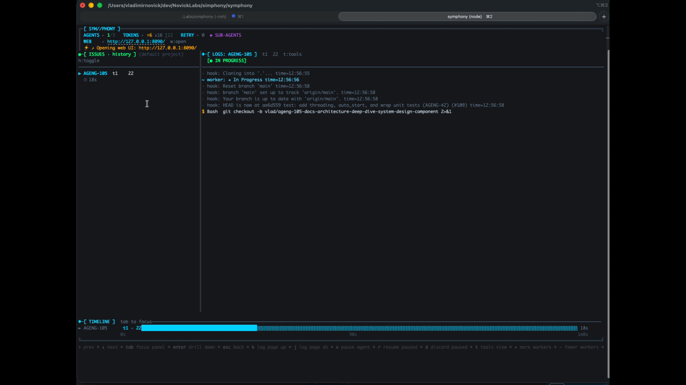

# Symphony Go

> A full Go implementation of the [OpenAI Symphony spec](https://github.com/openai/symphony/blob/main/SPEC.md) —
> a long-running daemon that polls Linear or GitHub, spawns Claude Code agents per issue,
> and gives you a live Kanban dashboard + terminal UI while they work.

[](https://www.youtube.com/watch?v=rzBZkc9Cvh0)

**[→ Quick Start](#quick-start) · [→ WORKFLOW.md Reference](#workflowmd-reference) · [→ HTTP Dashboard](#http-dashboard)**

---

[](https://github.com/vnovick/symphony-go/actions/workflows/ci-go.yml)
[](https://github.com/vnovick/symphony-go/actions/workflows/ci-web.yml)
[](go.mod)
[](https://github.com/vnovick/symphony-go/releases/latest)
[](LICENSE)
[](https://goreportcard.com/report/github.com/vnovick/symphony-go)
[](https://discord.gg/Q6FrQSrP)
[](https://codecov.io/gh/vnovick/symphony-go)

---

## Why Symphony Go?

| | Symphony Go |
|---|---|
| **Dashboard** | Live Kanban board with drag-to-move, log drilldown, token tracking |
| **TUI** | Bubbletea split-panel — issue tree + streaming agent logs |
| **Config** | One `WORKFLOW.md` file — YAML front matter + Liquid prompt template |
| **Trackers** | Linear GraphQL + GitHub Issues |
| **Agents** | Named profiles — run different Claude models per issue type |
| **Hot reload** | Edit `WORKFLOW.md` while running — config updates without restart |
| **Logs** | Persistent per-issue logs — survive restarts, streamed from disk |
| **Timeline** | Full run history — every agent session across all issues |
| **Binary** | Single static Go binary — no runtime, no Docker required |

---

## Requirements

### Runtime

| Requirement | Version | Notes |
|---|---|---|
| [Go](https://go.dev/dl/) | 1.23+ | Required to build from source |
| [Claude Code CLI](https://claude.ai/code) | latest | `claude --version` must succeed; must be authenticated |
| [gh CLI](https://cli.github.com/) | latest | Required for automatic PR detection and PR link comments on tracker issues |
| `git` | any | Must be available in PATH inside each workspace |

### Tracker credentials

| Tracker | Credential | Minimum scope |
|---|---|---|
| Linear | Personal API key | Full access (read issues, write comments and state) |
| GitHub Issues | Personal Access Token or fine-grained token | `repo` (or `issues: write` + `contents: read` for fine-grained) |

### Web dashboard dev loop (contributors)

```bash
# Terminal 1 — run symphony with the HTTP server enabled
./symphony path/to/WORKFLOW.md   # server.port: 8090 in WORKFLOW.md

# Terminal 2 — start the Vite dev server (proxies API calls to :8090)
cd web && pnpm dev               # opens at http://localhost:5173
```

### Building the web dashboard (optional, from source only)

| Requirement | Version |
|---|---|
| [Node.js](https://nodejs.org/) | 20+ |
| [pnpm](https://pnpm.io/) | 9+ |

The pre-built dashboard is embedded in the binary when you `go install` or download a release. Node.js and pnpm are only needed if you are building from source (`go generate ./internal/server/`).

---

## How It Works

Symphony runs a continuous orchestration loop:

```
┌─────────────────────────────────────────────────────────┐
│                     WORKFLOW.md                         │
│  ┌──────────────────────────────────────────────────┐   │
│  │ tracker: { kind: linear, api_key: $LINEAR_API_KEY│   │
│  │ agent:   { max_turns: 20 }                       │   │
│  ├──────────────────────────────────────────────────┤   │
│  │ You are working on {{ issue.identifier }}...     │   │
│  └──────────────────────────────────────────────────┘   │
└──────────────────────┬──────────────────────────────────┘
                       │ config + prompt template
                       ▼
┌──────────────────────────────────────────────────────────┐
│                   Orchestrator                           │
│                                                          │
│  every poll_interval_ms:                                 │
│    1. reconcile running sessions (stall check, state)    │
│    2. fetch candidate issues from tracker                │
│    3. for each eligible issue (sorted by priority):      │
│       ├─ create/reuse workspace dir                      │
│       ├─ run hooks (after_create, before_run)            │
│       ├─ render Liquid prompt template                   │
│       └─ spawn claude subprocess ──────────────────┐     │
│                                                    │     │
│  on worker exit:                                   │     │
│    ├─ success  → schedule 1s continuation retry   │     │
│    └─ failure  → exponential backoff retry        │     │
└────────────────────────────────────────────────────┼─────┘
                                                     │
                                           stream-json events
                                                     │
┌────────────────────────────────────────────────────▼─────┐
│                   Claude Code subprocess                 │
│                                                          │
│  claude -p "<rendered prompt>"                           │
│         --output-format stream-json                      │
│         --dangerously-skip-permissions                   │
│                                                          │
│  (continuation: claude --resume <session-id> ...)        │
│                                                          │
│  cwd = <workspace.root>/<issue-identifier>/              │
└──────────────────────────────────────────────────────────┘
```

### Key design decisions

- **Single-goroutine state machine.** All orchestrator state mutations happen in one goroutine. Worker goroutines communicate back via a buffered event channel — no locks needed on the hot path.
- **New subprocess per turn.** Claude Code uses `--resume <session-id>` for session continuity instead of a persistent app-server process. Conversation history lives in Claude's server-side session.
- **Isolated workspaces.** Each issue gets its own directory under `workspace.root`. Path containment is enforced via `filepath.EvalSymlinks` before every agent launch — symlink escape is rejected at runtime.
- **Live config reload.** `WORKFLOW.md` is watched with a 1-second content-hash poller (mtime+size fast-path, SHA-256 fallback). Config changes hot-reload without restarting in-flight agent sessions.

---

## Setup

### Prerequisites

See the [Requirements](#requirements) section at the top of this document for the full list. Quick checklist:

- Go 1.23+, `git`, `gh` CLI — all in PATH and authenticated
- [Claude Code CLI](https://claude.ai/code) installed and authenticated (`claude --version`)
- A Linear workspace **or** a GitHub repository with API credentials

### Install

**Homebrew (macOS / Linux):**

```bash
brew install vnovick/tap/symphony-go
```

**Go install:**

```bash
go install github.com/vnovick/symphony-go/cmd/symphony@latest
```

**Download a binary** from the [latest release](https://github.com/vnovick/symphony-go/releases/latest) — pre-built for macOS (arm64/amd64), Linux (arm64/amd64), and Windows.

Or build from source:

```bash
git clone https://github.com/vnovick/symphony-go
cd symphony-go

# Build the web dashboard (requires Node.js 20+ and pnpm 10+)
cd web && pnpm install --frozen-lockfile && pnpm build && cd ..

# Embed the dashboard and compile the binary
go generate ./internal/server/
go build -o symphony ./cmd/symphony

# Run it
./symphony -workflow path/to/WORKFLOW.md
```

For contributors, `make dev` runs the Go server and the Vite dev server together with HMR. See [CONTRIBUTING.md](CONTRIBUTING.md) for the full list of `make` commands.

### Commands

| Command | Description |
|---|---|
| `symphony` | Start the orchestrator (reads `WORKFLOW.md` in the current directory) |
| `symphony init --tracker <linear\|github>` | Scaffold a `WORKFLOW.md` from your repo's metadata |
| `symphony clear` | Remove all workspace directories under `workspace.root` |
| `symphony clear ENG-1 ENG-2` | Remove workspace directories for specific issues |
| `symphony --version` | Print version, commit, and build date |
| `symphony help` | Show all commands and run-mode flags |

**Run-mode flags** (used with the default `symphony` command):

| Flag | Default | Description |
|---|---|---|
| `-workflow` | `WORKFLOW.md` | Path to your WORKFLOW.md |
| `-logs-dir` | `log` | Directory for rotating log files |
| `-verbose` | false | Enable DEBUG-level logging (includes Claude output) |

**`symphony init` flags:**

| Flag | Default | Description |
|---|---|---|
| `--tracker` | required | `linear` or `github` |
| `--output` | `WORKFLOW.md` | Output file path |
| `--dir` | `.` | Directory to scan for repo metadata |
| `--force` | false | Overwrite existing output file |

---

### Quick start

1. Generate a `WORKFLOW.md` for your project:

```bash
# Scan the current directory and write a pre-filled WORKFLOW.md
symphony init --tracker linear    # or: --tracker github
```

This detects your git remote, default branch, and tech stack, then writes a
ready-to-edit `WORKFLOW.md`. Alternatively, create the file manually (see
[WORKFLOW.md Reference](#workflowmd-reference) below).

2. Edit `WORKFLOW.md` and fill in your API key:

```yaml
tracker:
  api_key: $LINEAR_API_KEY   # or paste the key directly
```

3. Export your credentials and run:

```bash
export LINEAR_API_KEY=lin_api_...
symphony
# or with an explicit path:
symphony -workflow path/to/WORKFLOW.md
```

---

## WORKFLOW.md Reference

The file has two sections separated by `---` front matter delimiters:

```markdown
---
<YAML configuration>
---

<Liquid prompt template>
```

### Configuration fields

#### `tracker`

| Field | Default | Description |
|---|---|---|
| `kind` | required | `linear` or `github` |
| `api_key` | required | API token or `$ENV_VAR` reference |
| `project_slug` | required | Linear `slugId` or GitHub `owner/repo` |
| `endpoint` | tracker default | Override API endpoint URL (defaults to `https://api.linear.app/graphql` for Linear) |
| `active_states` | `["Todo", "In Progress"]` | Issue states to pick up and work on |
| `terminal_states` | `["Closed", "Cancelled", "Canceled", "Duplicate", "Done"]` | States that end the agent session |
| `working_state` | `"In Progress"` | State to transition an issue to when it is first dispatched to an agent. Set to `""` to disable auto-transition. |
| `completion_state` | `""` | State to transition to when the agent finishes successfully (e.g. `"In Review"`). When set, the issue leaves `active_states` so Symphony stops re-dispatching it. |
| `backlog_states` | `["Backlog"]` (Linear) / `[]` (GitHub) | States shown in the Backlog column of the web Kanban board. Issues here are visible but not auto-dispatched. |

#### `polling`

| Field | Default | Description |
|---|---|---|
| `interval_ms` | `30000` | How often to poll the tracker (milliseconds) |

#### `agent`

| Field | Default | Description |
|---|---|---|
| `command` | `claude` | Claude CLI command (can include flags, e.g. `claude --model claude-opus-4-6`) |
| `max_concurrent_agents` | `10` | Global concurrency cap — max issues running simultaneously |
| `max_concurrent_agents_by_state` | `{}` | Per-state concurrency caps. State keys are normalized to lowercase. Example: `{"in progress": 3}` |
| `max_turns` | `20` | Max turns per agent session before ending and scheduling a retry |
| `turn_timeout_ms` | `3600000` | Hard time limit per subprocess turn (1 hour). Set lower for faster failure detection. |
| `read_timeout_ms` | `30000` | Per-line idle timeout (ms). Triggers stall detection if no output is received. |
| `stall_timeout_ms` | `300000` | Total silence budget before a session is killed (5 min). Set `0` to disable stall detection. |
| `max_retry_backoff_ms` | `300000` | Caps the exponential retry backoff at this value (5 min). |
| `agent_mode` | `""` | Agent collaboration model. `""` = solo (default). `"teams"` = profile role context injected into the prompt so Claude knows which specialised sub-agents are available. |
| `profiles` | `{}` | Named agent profiles. Each profile can override `command` and provide a role `prompt`. Select per-issue from the web UI. See example below. |
| `reviewer_prompt` | built-in | Liquid template for AI reviewer worker dispatched via the "AI Review" button. Falls back to a built-in prompt that reviews the PR and moves the issue. |
| `ssh_hosts` | `[]` | Optional list of `"host"` or `"host:port"` addresses. When set, agent turns are executed on these hosts via SSH in order, falling back to the next on failure. Empty = run locally. See [SSH worker hosts](#ssh-worker-hosts). |

**Profiles example:**

```yaml
agent:
  profiles:
    code-reviewer:
      command: claude --model claude-opus-4-6
      prompt: "You are a senior code reviewer. Focus on correctness and test coverage."
    fast-fixer:
      command: claude --model claude-haiku-4-5
      prompt: "You are a rapid bug fixer. Move fast and write a test for each fix."
```

#### SSH Worker Hosts

When `agent.ssh_hosts` is set, Symphony executes each Claude turn on a remote machine over SSH instead of locally. The workspace path must exist on the remote host (e.g. via an NFS share or prior provisioning hook).

```yaml
agent:
  ssh_hosts:
    - build-worker-1.internal
    - build-worker-2.internal:2222
```

Hosts are tried in order — if the first host fails, Symphony falls back to the next. The session continues on whichever host succeeds.

**Host key requirement:** Symphony uses `BatchMode=yes` and relies on `~/.ssh/known_hosts` for host verification. You must add each worker host's key before starting Symphony, otherwise SSH will refuse to connect:

```bash
ssh-keyscan build-worker-1.internal >> ~/.ssh/known_hosts
ssh-keyscan -p 2222 build-worker-2.internal >> ~/.ssh/known_hosts
```

#### `workspace`

| Field | Default | Description |
|---|---|---|
| `root` | `~/.simphony/workspaces` | Root directory for per-issue workspaces. Supports `~` expansion and `$ENV_VAR` references. |

#### `hooks`

Shell scripts run at lifecycle events. Run via `bash -lc` in the workspace directory.

| Field | Default | On failure |
|---|---|---|
| `after_create` | — | Fatal — aborts the run attempt |
| `before_run` | — | Fatal — aborts the run attempt |
| `after_run` | — | Logged and ignored |
| `before_remove` | — | Logged and ignored |
| `timeout_ms` | `60000` | Applies to all hooks |

Example — clone a repo into a fresh workspace:

```yaml
hooks:
  after_create: |
    git clone git@github.com:org/repo.git .
  before_run: |
    git fetch origin && git reset --hard origin/main
```

#### `server`

| Field | Default | Description |
|---|---|---|
| `port` | unset | HTTP server port. Disabled when absent |
| `host` | `127.0.0.1` | Bind address |

### Prompt template

The prompt body is a [Liquid](https://shopify.github.io/liquid/) template rendered in strict mode (unknown variables are errors).

Available variables:

| Variable | Type | Description |
|---|---|---|
| `issue.id` | string | Tracker-internal ID |
| `issue.identifier` | string | Human-readable identifier (e.g. `ENG-42`, `#42`) |
| `issue.title` | string | Issue title |
| `issue.description` | string or nil | Issue body |
| `issue.state` | string | Current state name |
| `issue.priority` | int or nil | Priority (lower = higher) |
| `issue.url` | string or nil | Link to the issue |
| `issue.branch_name` | string or nil | Suggested branch (Linear only) |
| `issue.labels` | array of strings | Lowercase label names |
| `issue.blocked_by` | array | Blocker refs: `id`, `identifier`, `state` |
| `issue.created_at` | string | RFC 3339 timestamp |
| `issue.updated_at` | string | RFC 3339 timestamp |
| `attempt` | int or nil | Retry attempt number (1-based), nil on first attempt |

---

## Tracker Setup

### Linear

1. Create an API key at **Settings → API → Personal API Keys**
2. Find your project slug in the URL: `linear.app/your-org/projects/your-project-slug/...`
3. Set `tracker.kind: linear` and `tracker.api_key: $LINEAR_API_KEY`

Issues are fetched from the configured project filtered by `active_states`. The `state` field in the template matches the Linear workflow state name exactly.

### GitHub Issues

1. Create a Personal Access Token with `repo` scope (or a fine-grained token with Issues read access)
2. Set `tracker.project_slug` to `owner/repo`
3. Set `tracker.kind: github` and `tracker.api_key: $GITHUB_TOKEN`

GitHub Issues don't have named workflow states. Symphony maps them via **labels**:
- Open issue with an **active label** → eligible for dispatch
- Open issue with a **terminal label** → treated as done
- **Closed** issue → always terminal regardless of labels

```yaml
tracker:
  kind: github
  api_key: $GITHUB_TOKEN
  project_slug: myorg/myrepo
  active_states: ["todo", "in-progress"]  # label names — create these in your repo
  terminal_states: ["done", "cancelled"]
  working_state: "in-progress"            # applied when agent starts; must exist as a label
  completion_state: "in-review"           # applied when agent finishes; must exist as a label
  backlog_states: ["backlog"]             # must be an array, not a bare string
```

#### Required labels

Create these labels in your GitHub repo before running Symphony (`github.com/<owner>/<repo>/labels`):

| Label | Color suggestion | Purpose |
|---|---|---|
| `todo` | `#0075ca` | Issues ready to be picked up |
| `in-progress` | `#e4e669` | Issue is being worked on by an agent |
| `in-review` | `#d93f0b` | Agent finished — PR open, awaiting review |
| `done` | `#0e8a16` | Work accepted and merged |
| `cancelled` | `#cccccc` | Issue closed without action |
| `backlog` | `#f9f9f9` | Tracked but not yet ready |

You can create them via the GitHub CLI:

```bash
gh label create "todo"        --color "0075ca" --repo owner/repo
gh label create "in-progress" --color "e4e669" --repo owner/repo
gh label create "in-review"   --color "d93f0b" --repo owner/repo
gh label create "done"        --color "0e8a16" --repo owner/repo
gh label create "cancelled"   --color "cccccc" --repo owner/repo
gh label create "backlog"     --color "f9f9f9" --repo owner/repo
```

#### GitHub Projects v2 vs Labels

**GitHub Projects v2 "Status"** (the Backlog / In Progress / Done column you see in the Projects board) is **completely separate** from issue labels. Symphony only reads and writes **labels** — it does not interact with Projects v2 status fields.

If you manage work through a Projects board, use [GitHub Projects automation](https://docs.github.com/en/issues/planning-and-tracking-with-projects/automating-your-project/using-the-built-in-automations) to sync the Status field → labels:
- Status "Todo" → add label `todo`
- Status "In Progress" → add label `in-progress`
- Status "Done" → add label `done`

#### `working_state` — important for GitHub

`working_state` is the label Symphony applies when an agent starts working on an issue (transitions it away from `todo`). The **default is `"In Progress"`** — a label that does not exist in most repos.

If `working_state` refers to a label that doesn't exist in your repo, Symphony will delete the existing active label and fail to add the new one, leaving the issue with **no state label at all**. It then disappears from Symphony silently.

**Fix:** either create the label first (recommended — use the `gh label create` commands above), or set `working_state: "todo"` to keep the issue in its current state throughout the agent run.

#### `backlog_states` syntax

`backlog_states` must be a YAML **array**, not a bare string:

```yaml
# ✓ correct
backlog_states: ["backlog"]

# ✗ wrong — silently ignored, backlog panel stays empty
backlog_states: "backlog"
```

---

## HTTP Dashboard

Add `server.port` to your `WORKFLOW.md` front matter:

```yaml
---
tracker:
  kind: linear
  api_key: $LINEAR_API_KEY
  project_slug: your-project
server:
  port: 8090
---
```

Then start symphony and open your browser:

```bash
./symphony
open http://127.0.0.1:8090
```


The dashboard shows a Kanban board (drag to move issues between states), a list view, live running sessions, token counts, and per-issue agent logs. It auto-refreshes, or you can hit the **Refresh** button to trigger an immediate poll.

| Endpoint | Description |
|---|---|
| `GET /` | HTML dashboard — running sessions, retry queue |
| `GET /api/v1/state` | Full JSON snapshot of all orchestrator state |
| `GET /api/v1/<identifier>` | Per-issue details (e.g. `/api/v1/ENG-3`) |
| `POST /api/v1/refresh` | Trigger an immediate tracker poll (returns 202) |
| `PATCH /api/v1/issues/{identifier}/state` | Move issue to a new workflow state (Kanban drag) |
| `POST /api/v1/issues/{identifier}/profile` | Set per-issue agent profile override |
| `GET /api/v1/issues/{identifier}/logs` | Stream log entries for an issue |
| `POST /api/v1/settings/workers` | Adjust max concurrent agents at runtime |
| `GET /api/v1/events` | SSE stream — push state snapshots to the browser |

The server binds `127.0.0.1` only and is not intended for public exposure.

---

## Terminal UI (TUI)

Symphony ships with a Bubbletea split-panel TUI. No web browser required.



```
┌──────────────────────┬──────────────────────────────────────────────────┐
│ ▶ ENG-42  Running    │ [ENG-42] ⚙ bash — go test ./...                  │
│   t7  12.4k tokens   │ [ENG-42] ⚙ str_replace_editor — auth/handler.go  │
│ ▶ ENG-43  Running    │ [ENG-42] Claude: all tests pass, opening PR       │
│   t3   4.1k tokens   │                                                  │
│ ○ ENG-44  Queued     │                                                  │
└──────────────────────┴──────────────────────────────────────────────────┘
  ↑/↓ prev/next · enter drill down · esc back · k log up · j log dn
  x pause · r resume · d discard · t tools view · b backlog · h history
  + more workers · - fewer workers · p project filter · o open PR · w web UI · q quit
```

| Key | Action |
|---|---|
| `↑` / `↓` | Navigate issues / timeline entries in the left panel |
| `space` | Expand / collapse nav item |
| `enter` | Drill into tool detail, timeline phase, or focus right panel |
| `esc` | Go back / close detail view |
| `tab` | Cycle focus: left panel → right panel → timeline |
| `j` / `k` | Scroll log pane down / up |
| `x` | Pause selected running agent |
| `r` | Resume a paused agent |
| `d` | Discard (terminate) a paused agent |
| `b` | Toggle backlog panel — `enter` to dispatch immediately |
| `h` | Toggle history tab |
| `t` | Toggle tools / logs view in right panel |
| `+` / `-` | Increase / decrease max concurrent workers |
| `p` | Open project filter picker |
| `o` | Open PR URL in browser |
| `w` | Open web dashboard in browser |
| `q` / `ctrl+c` | Exit |


---

## Timeline

The Timeline page (accessible from the web dashboard) shows every agent session across all issues — including completed, failed, and retried runs.

Logs are persisted to disk under `workspace.root` and survive daemon restarts. When you re-open the dashboard after restarting Symphony, all previous session logs are still accessible.

---

## Retry Behaviour

| Exit condition | Next action |
|---|---|
| Clean exit (turn limit or tracker state changed) | Retry after **1 second** |
| Failure or timeout | Exponential backoff: `10s × 2^(attempt-1)`, capped at `max_retry_backoff_ms` |
| `input_required` from Claude | Hard fail, then normal backoff retry |
| Stall timeout exceeded | Kill session, normal backoff retry |

---

## Security Posture

Symphony is designed for **high-trust local environments**:

- Claude runs with `--dangerously-skip-permissions` — it can read, write, and execute files without asking for approval. Only run against code you trust.
- API tokens are never logged. Use `$ENV_VAR` references in config; the value is resolved at runtime and not written to disk.
- The HTTP server binds `127.0.0.1` only.
- Workspace path containment is enforced via `filepath.EvalSymlinks` before every agent launch. Symlink escapes outside `workspace.root` are rejected.
- Hook scripts are sourced from `WORKFLOW.md` and run with full shell access in the workspace directory. Treat them as trusted code.
- SSH worker hosts (`agent.ssh_hosts`) use standard host key verification via `~/.ssh/known_hosts`. Run `ssh-keyscan <host> >> ~/.ssh/known_hosts` before adding a host to the list. Symphony does not disable host key checking.

---

## Community

[Join the Discord](https://discord.gg/Q6FrQSrP) — questions, show your WORKFLOW.md, feature requests.

---

## License

Apache 2.0. See [LICENSE](LICENSE).
